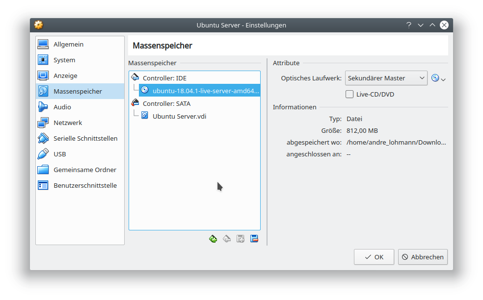
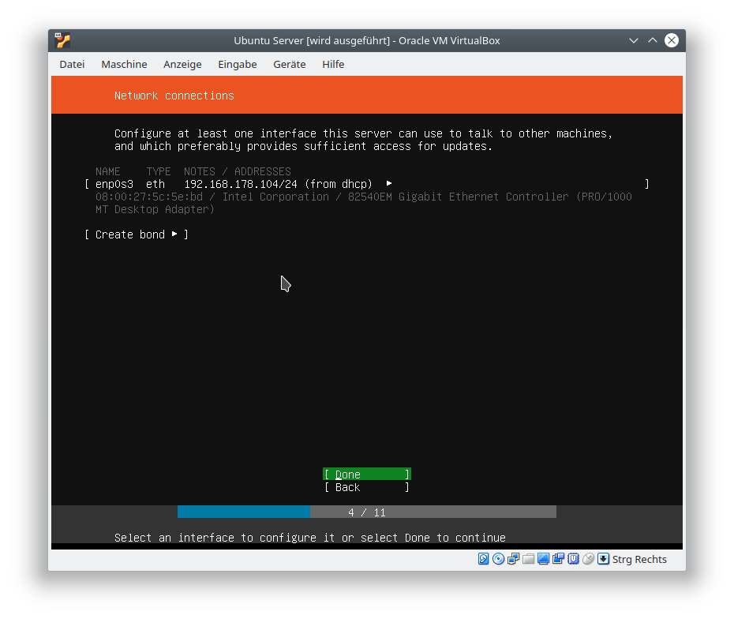
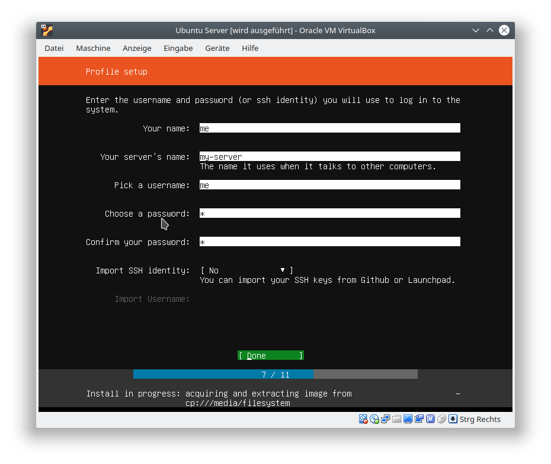

# VirtualBox Einführung

VirtualBox erlaubt das Konfigurieren und Starten von virtuellen Computern/Servern auf dem eigenen Rechner

## OS Image

Um einen virtuellen Server einzurichten wird ein Installations Medium benötigt. Die Demonstration findet auf Basis eines Ubuntu Server LTS Image statt. Dieses wird unter dem folgenden Link herunter geladen:

https://www.ubuntu.com/download/server

## Virtuelle Maschine erstellen

VirtualBox wird geöffnet und anschließend auf "Neu" geklickt


Name und Betriebssystem festlegen


Speichergröße festlegen


Festplatte erzeugen


## Virtuelle Maschine Konfigurieren

Die gewünschte Maschine wird ausgewält und anschließend auf "Ändern" geklickt


System -> Hauptplatine: Diskette abwählen und Zeigegerät auf PS/2-Maus umstellen


System -> Prozessor: Dem Prozessor der virtuellen Maschine dürfen mindestens 2 Kerne zugeteilt werden


Massenspeicher: Auf das CD Symbol mit Pfeil nach unten neben "Optisches laufwerk" klicken und "Datei für optisches Medium auswählen..." klicken


Massenspeicher: Das zuvor herunter geladene Ubuntu Server Image suchen und auswählen


Massenspeicher: Das Image sollte nun für den Controller: IDE ausgewählt sein



Audio: Audio abwählen, da der Server keine Audio Schnittstelle benötigt


Netzwerk: Netzwerktyp "Netzwerkbrücke" wählen


Nach abschließender Konfiguration kann die Maschine gestartet werden

## Maschine installieren

Nach dem Start der Maschine läuft der Installations Prozess der Ubuntu Server Installationsmediums durch








## IP Adresse ermitteln

Nach dem Reboot meldet sich der Login Dialog


Nach Verwendung der Login Daten, welche während der Installation vergeben wurden, wird die IP Adresse durch die Eingabe folgenden Kommandos ermittelt:

```
ip a
```


Aus der Ausgabe geht hervor, dass die Beispiel Maschine die IP Adresse "192.168.178.104" besitzt

## Die neue Maschine verwenden

Um die neue Maschine zu benutzen, wird nun unter Verwendung des Snapcraft Paketmanagers das Open Source Kanban Board Wekan installiert

Dazu wird die Maschine als erstes per SSH vom Host aus betreten

```
ssh me@192.168.178.104
```

Anschließend wird auf den "root" User gewechselt

```
sudo -i
```

Nun wird der Snap Paketmanager installiert

```
apt install snapd
```

Mit den folgenden Kommandos wird nun Wekan installiert und konfiguriert

```
snap install wekan
snap set wekan root-url="http://192.168.178.104/wekan"
snap set wekan port='80'
systemctl restart snap.wekan.wekan
```

Nach Abschluss der Installation lässt sich das Wekan Board im Browser öffnen

http://192.168.178.104/wekan
